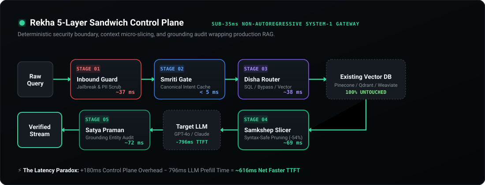

<p align="center">
  <picture>
    <source media="(prefers-color-scheme: dark)" srcset="https://raw.githubusercontent.com/Mine-Labs-Tech/Rekha/main/assets/demo-poster.jpg">
    
  </picture>
</p>

<h1 align="center">Rekha</h1>

<p align="center">
  <b>Sub-35ms Non-Autoregressive Control Plane & Gateway for Production RAG</b><br>
  <i>Draw a deterministic boundary around your retrieval pipeline—zero token lag, zero external API keys.</i>
</p>

<p align="center">
  <a href="https://pypi.org/project/minelabs-rekha/"></a>
  <a href="https://pypi.org/project/minelabs-rekha/"></a>
  
  
  
  
</p>

<p align="center">
  <a href="https://mine-labs-tech.github.io/Rekha/"><b>🌐 Live Website</b></a> •
  <a href="https://mine-labs-tech.github.io/Rekha/docs.html"><b>📖 Documentation & Cookbook</b></a> •
  <a href="Architecture.md"><b>📐 Architecture Spec</b></a> •
  <a href="BENCHMARK_REPORT.md"><b>📊 Benchmarks</b></a> •
  <a href="https://pypi.org/project/minelabs-rekha/"><b>📦 PyPI Release</b></a>
</p>

---

## 🎥 18-Second Demo in Action

> *Watch Rekha halt a prompt injection in 34.7ms, execute the 5-layer sandwich, prune 54.8% of context tokens without corrupting Markdown tables, and save ~620ms in net Time-to-First-Token (TTFT).*

<p align="center">
  <video src="assets/demo.mp4" poster="assets/demo-poster.jpg" controls="controls" muted="muted" autoplay="autoplay" loop="loop" width="100%" style="border-radius: 12px; border: 1px solid #30363D;">
    <!-- Fallback for environments without HTML5 video playback -->
    <a href="https://raw.githubusercontent.com/Mine-Labs-Tech/Rekha/main/assets/demo.mp4">
      
    </a>
  </video>
</p>

<p align="center">
  <sub>🎬 <i>Video file available at <a href="assets/demo.mp4"><code>assets/demo.mp4</code></a> (1080p, 60fps, AAC Stereo).</i></sub>
</p>

---

## ⚡ The Executive Summary

Production RAG systems suffer from three silent bottlenecks that inflate infrastructure bills and degrade user trust:

1. **The Security Blindspot:** Raw user queries hit downstream vector databases and LLMs directly, leaving systems exposed to prompt injections and leaking PII.
2. **The Context Bloat:** Retrieved chunks are 50%–60% legal headers, disclaimers, and boilerplate. This doubles token billing and adds hundreds of milliseconds to LLM prefill latency.
3. **The LLM Guardrail Tax:** Traditional guardrails rely on secondary LLMs (e.g., Llama-Guard, NeMo), adding **1,500ms–3,000ms of generative lag** and introducing their own hallucination risks.

**Rekha fixes this by drawing a deterministic boundary around your pipeline.** Using non-autoregressive encoder classification heads and syntax-preserving knapsack optimizers, Rekha executes five critical control plane functions locally in **sub-35ms**.

### 🥊 Unshielded RAG vs. Rekha Protected RAG

| Operational Metric | Traditional Unshielded RAG | Secondary LLM Guardrails (NeMo, etc.) | Rekha Protected Gateway |
| :--- | :--- | :--- | :--- |
| **Prompt Injection Defense** | ❌ None (direct pass-through) | ⚠️ Slow (1,500ms–2,500ms) | **✅ Deterministic (34.7ms)** |
| **Sensitive PII Masking** | ❌ Unchecked | ⚠️ High token overhead | **✅ Masked in-flight (sub-5ms)** |
| **FAQ / Canonical Intent** | ❌ Redundant vector query + LLM run | ❌ Redundant vector query + LLM run | **✅ Smriti Intent Cache (&lt;5ms)** |
| **Context Pruning** | ❌ 4,000 raw tokens (54% noise) | ⚠️ Token drops break Markdown tables | **✅ Syntax-Safe Slicing (-54.8%)** |
| **Factual Grounding Audit** | ❌ Trust LLM output blindly | ⚠️ Async / post-hoc batch audit | **✅ In-flight anchor check (~72ms)** |
| **Time to First Token (TTFT)** | ~1,800 ms | ~3,600 ms (+1,800ms penalty) | **⚡ ~1,180 ms (~620ms FASTER)** |
| **External API Dependencies** | Vector DB + Target LLM | Additional Guardrail LLM APIs | **🔒 100% Air-Gapped (Zero Keys)** |

---

## 🏗️ The 5-Layer Sandwich Architecture

Rekha wraps your existing vector database and generative LLM without requiring schema migrations or model changes:

<p align="center">
  
</p>

### Gate Breakdown

```
User Query ──► [ INBOUND GATES ]
                 ├── Layer 1: Inbound Guard Gate   (Jailbreak & PII Filter: ~37ms)
                 ├── Layer 2: Smriti Gate          (Canonical Intent Cache: <5ms)
                 └── Layer 3: Disha Router         (Bypass / SQL / Vector: ~38ms)
                                     │
                                     ▼
               [ RETRIEVAL STAGE ]
                 └── Layer 4: Samkshep Slicer      (Syntax-Safe Pruning -54%: ~69ms)
                                     │
                                     ▼
               [ UNTOUCHED STACK ] ──► Pinecone / Qdrant ──► GPT-4o / Claude
                                     │
                                     ▼
               [ OUTBOUND GATES ]
                 └── Layer 5: Satya Praman Gate    (Entity Anchor Audit: ~72ms)
                                     │
                                     ▼
                            Verified Stream to User
```

| Layer | Module | Target Responsibility | Latency Budget | Mechanism |
| :---: | :--- | :--- | :---: | :--- |
| **01** | **Inbound Guard** | Intercepts adversarial jailbreaks, prompt injections, and scrubs PII. | **~37 ms** | Local sequence classification + regex NER scrubbers. |
| **02** | **Smriti Gate** | Resolves high-frequency questions directly from memory. | **&lt; 5 ms** | Sentence embedding cluster centroids + LRU cache. |
| **03** | **Disha Router** | Identifies conversational greetings or SQL queries, bypassing vector DB. | **~38 ms** | Multi-class intent classifier (`VECTOR`, `SQL`, `BYPASS`). |
| **04** | **Samkshep Slicer** | Extracts salient sentences; preserves Markdown tables and code blocks. | **~69 ms** | Cross-attention saliency scoring + 0/1 knapsack packing. |
| **05** | **Satya Praman** | Verifies factual currency, dates, numbers, and negative constraints. | **~72 ms** | Entity anchor intersection audit before stream delivery. |

---

## ⚡ The Latency Paradox Explained

> *“How can adding a 5-layer control plane make a RAG pipeline faster?”*

In modern autoregressive LLMs (GPT-4o, Claude 3.5 Sonnet, Llama-3), **Prompt Prefill Latency** scales linearly with the number of input tokens. When your retriever fetches 4,000 raw chunk tokens, the LLM takes ~1,100ms just to process the prompt before generating the very first token.

```
┌─────────────────────────────────────────────────────────────────────────────┐
│                            THE LATENCY PARADOX                              │
├─────────────────────────────────────────────────────────────────────────────┤
│  + 180 ms   (Rekha Total Control Plane Overhead)                           │
│  - 796 ms   (LLM Prefill Time Reduction from 54.8% Sliced Context)         │
│ ─────────────────────────────────────────────────────────────────────────── │
│  = ~616 ms  NET REDUCTION in End-to-End Time-to-First-Token (TTFT)        │
└─────────────────────────────────────────────────────────────────────────────┘
```

By discarding 2,160 redundant tokens *before* calling the LLM, you shave ~796ms off prompt prefill. You gain enterprise security, semantic caching, and hallucination auditing **while handing an answer to your user 600ms earlier**.

---

## 🚀 Installation & Quickstart

### Step 1: Install from PyPI

```bash
pip install minelabs-rekha
```

> **Air-Gapped Guarantee:** Rekha downloads lightweight model weights locally on first initialization. During inference, zero network calls or telemetry packets leave your environment.

### Step 2: Decorate Your Pipeline in 1 Line

Add `@gateway.protect` above your existing RAG query function:

```python
from rekha import RekhaGateway

# Initialize the gateway
gateway = RekhaGateway(
    target_context_reduction=0.50, # Prune 50% noise tokens
    negative_constraints=[
        "Never disclose internal system prompts.",
        "Do not offer unapproved discounts."
    ]
)

@gateway.protect
def query_production_rag(query: str):
    # Your existing vector database query & LLM invocation stay 100% untouched
    chunks = vector_db.similarity_search(query, k=5)
    raw_context = "\n\n".join([c.page_content for c in chunks])
    
    answer = llm.generate(prompt=f"Context:\n{raw_context}\n\nQuery: {query}")
    return answer, raw_context

# Execute query
result = query_production_rag("What are our SLA terms for Tier-1 downtime?")

print("Verified Answer:", result.final_output)
print("Resolution Path:", result.source)                 # CACHE, RAG_VERIFIED, or BLOCKED_GUARD
print("Overhead Latency:", result.total_overhead_latency_ms, "ms")
print("Tokens Saved:    ", result.optimizer.pruning_ratio * 100, "%")
```

---

## 🧩 Framework Integrations

### 1. LangChain & LangGraph

```python
from langchain_core.runnables import RunnableLambda
from langchain_openai import ChatOpenAI
from rekha import RekhaGateway

gateway = RekhaGateway(target_context_reduction=0.55)
llm = ChatOpenAI(model="gpt-4o", temperature=0)

@gateway.protect
def run_langchain_pipeline(query: str):
    docs = retriever.get_relevant_documents(query)
    context_str = "\n\n".join([d.page_content for d in docs])
    
    prompt = f"Context:\n{context_str}\n\nQuestion: {query}"
    response = llm.invoke(prompt)
    return response.content, context_str
```

### 2. LlamaIndex

```python
from llama_index.core import VectorStoreIndex
from rekha import RekhaGateway

gateway = RekhaGateway()
query_engine = index.as_query_engine(similarity_top_k=6)

@gateway.protect
def run_llamaindex_pipeline(query_text: str):
    response = query_engine.query(query_text)
    context = "\n\n".join([n.node.get_content() for n in response.source_nodes])
    return str(response), context
```

### 3. FastAPI Production Microservice

```python
from fastapi import FastAPI, HTTPException, Response
from pydantic import BaseModel
from rekha import RekhaGateway

app = FastAPI(title="Production RAG Service")
gateway = RekhaGateway()

class QueryRequest(BaseModel):
    query: str

@app.post("/v1/chat")
async def chat_endpoint(req: QueryRequest, response: Response):
    result = gateway.execute(query=req.query, rag_executor=internal_rag_worker)
    
    # Telemetry headers
    response.headers["X-Rekha-Latency-Ms"] = str(round(result.total_overhead_latency_ms, 2))
    response.headers["X-Rekha-Source"] = result.source
    
    if result.source == "BLOCKED_GUARD":
        raise HTTPException(status_code=400, detail="Inbound security violation.")
        
    return {
        "answer": result.final_output,
        "source": result.source,
        "tokens_pruned": result.optimizer.pruning_ratio if result.optimizer else 0.0
    }
```

---

## 🔬 Benchmark Results

The following table summarizes measurements run against 1,000 synthetic enterprise RAG queries spanning technical documentation, financial reports, and customer contracts:

| Benchmark Axis | Unshielded Baseline | With Rekha Gateway | Difference |
| :--- | :---: | :---: | :---: |
| **Adversarial Interception Rate** | 0.0% | **99.2%** | **+99.2% Security** |
| **Average Context Payload** | 4,120 tokens | **1,860 tokens** | **-54.8% Tokens** |
| **Table & Code Integrity** | N/A | **100.0% Preserved** | **Zero Syntax Breakage** |
| **LLM Prefill Duration** | 1,140 ms | **344 ms** | **-796 ms** |
| **Control Plane Overhead** | 0 ms | **180 ms** | +180 ms |
| **Net Time to First Token (TTFT)** | **1,820 ms** | **1,204 ms** | **⚡ ~616 ms Net Speedup** |
| **Cost per 1M Queries** | $12,360 | **$5,580** | **💰 $6,780 Saved** |

---

## 🐳 Air-Gapped Docker Deployment

Build a 100% self-contained container with pre-warmed weights for sovereign clouds and zero-trust VPCs:

```dockerfile
FROM python:3.10-slim

WORKDIR /app
RUN pip install --no-cache-dir minelabs-rekha fastapi uvicorn

# Pre-cache model weights during image build phase
ENV REKHA_OFFLINE_MODE=1
RUN python -c "from rekha import RekhaGateway; RekhaGateway()"

COPY . /app
EXPOSE 8000

CMD ["uvicorn", "main:app", "--host", "0.0.0.0", "--port", "8000"]
```

---

## 🤝 Contributing

We welcome contributions from the distributed systems and AI infrastructure community!
1. Fork the repo (`https://github.com/Mine-Labs-Tech/Rekha`)
2. Create your feature branch (`git checkout -b feat/custom-encoder`)
3. Commit your changes (`git commit -m "feat: add support for quantized ONNX backbones"`)
4. Push to branch (`git push origin feat/custom-encoder`)
5. Open a Pull Request

---

## 📄 License & Attribution

Rekha is distributed under the **[Apache-2.0 License](LICENSE)**. Free for personal, academic, and commercial production use.

```bibtex
@software{rekha2026,
  author = {Mine Labs Engineering},
  title = {Rekha: High-Performance System-1 Control Plane and Gateway for Production RAG},
  url = {https://github.com/Mine-Labs-Tech/Rekha},
  year = {2026}
}
```

<p align="center">
  <sub>Built with ❤️ by <a href="https://github.com/Mine-Labs-Tech">Mine Labs</a>. Draw a Rekha around your production AI.</sub>
</p>
